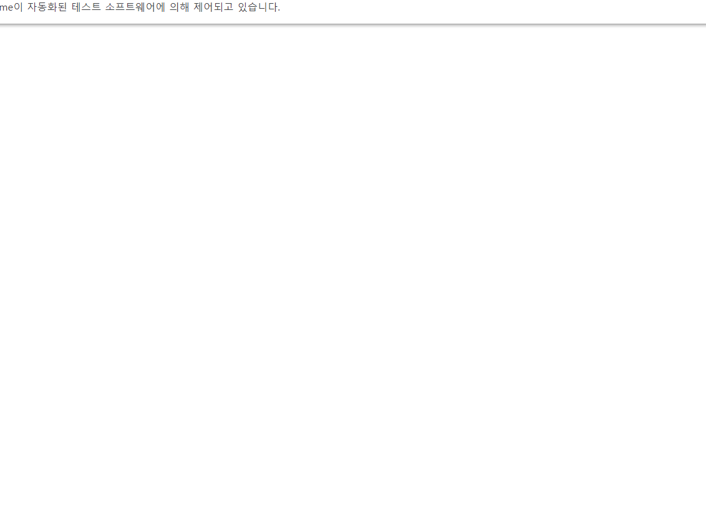
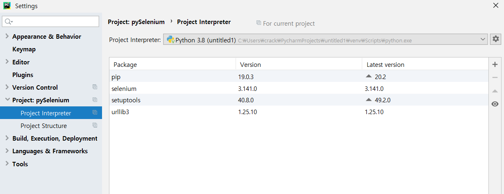

# Python Selenium example
> Selenium을 이용한 Chrome 브라우저 제어

- Chrome Driver는 [웹사이트](https://chromedriver.chromium.org/downloads)에서 자신의 PC에 설치된 크롬브라우저 버전과 동일한 것을 다운로드 받아야 한다.
- selenium 설치: pip install selenium

- chrome에서 DOM 찾기
    - shift + ctrl + c
    - 마우스로 원하는 위젯클릭
    - 소스코드로 이동
    
- chrome에서 xpath 찾기
    - 위의 방법대로 DOM으로 이동
    - 마우스 우클릭
    - copy -> copy xpath

~~~python
import time

from selenium import webdriver
from selenium.webdriver.chrome.options import Options

# 크롬에서 DOM 찾는법
# 1. shift + ctrl + c
# 마우스로 원하는 위젯클릭
# 소스코드로 이동

# Youtube 
def doGetYoutube():
    options = Options()
    options.headless = True
    browser = webdriver.Chrome(executable_path="./chromedriver.exe", options=options)
    keyword = "철권7"
    browser.get("https://www.youtube.com/results?search_query=" + keyword)
    time.sleep(5)

    titleList  = browser.find_elements_by_xpath('//*[@id="video-title"]')
    countList  = browser.find_elements_by_xpath('//*[@id="metadata-line"]')
    ownerList  = browser.find_elements_by_xpath('//*[@id="byline-container"]')

    count = len(titleList)
    for i in range (count):
        title = titleList[i]
        info  = countList[i]
        owner = ownerList[i]
        print(title.text + "\n- " + info.text.replace ("\n", " ") + "\n- " + owner.text.replace ("\n", " ") + "\n" + title.get_attribute('href'))
        print("\n")

    time.sleep(5)

#  날씨가져오기
def doGetWeather():
    options = Options()
    options.headless = False
    browser = webdriver.Chrome(executable_path="./chromedriver.exe", options=options)

    # 날씨검색
    browser.get("https://www.google.com/search?q=%EB%82%A0%EC%94%A8&sourceid=chrome&ie=UTF-8")
    time.sleep(3)

    # 날씨출력
    where   = browser.find_elements_by_xpath("//*[@id=\"wob_loc\"]")
    print("위치:" + where[0].text)
    curtime = browser.find_elements_by_xpath("//*[@id=\"wob_dts\"]")
    print("시간:" + curtime[0].text +"\n")

    temp = browser.find_elements_by_xpath("// *[ @ id = \"wob_tm\"]")
    print("온도:" + temp[0].text + "\n\n")

def GoogleVK():
    options = Options()
    options.headless = False
    browser = webdriver.Chrome(executable_path="./chromedriver.exe", options=options)

    # blog 접속시 리다이렉션 되는 주소를 크롬에서 찾아보아야 한다.
    browser.get("https://google.com")

    keys = [
        # 가상키보드 on/off
        "//*[@id='tsf']/div[2]/div[1]/div[1]/div/div[3]/div[2]/span",

        "// *[ @ id = \"K20\"] / span",
        "//*[@id=\"K86\"]",
        "//*[@id=\"K73\"]",
        "//*[@id=\"K78\"]",
        "//*[@id=\"K84\"]",
        "//*[@id=\"K65\"]",
        "//*[@id=\"K71\"]",
        "//*[@id=\"K69\"]",

        # 가상키보드 on/off
        "//*[@id='tsf']/div[2]/div[1]/div[1]/div/div[3]/div[2]/span",

        # 검색버튼
        "//*[@id=\"tsf\"]/div[2]/div[1]/div[3]/center/input[1]"

    ]

    for k in keys:
        vk = browser.find_element_by_xpath(k)
        vk.click()
        time.sleep(1)

    sound = browser.find_element_by_xpath("//*[@id=\"tw-source-rmn\"]/span")
    print(sound.text)

    soundPlay = browser.find_element_by_xpath("//*[@id=\"tw-src-spkr-button\"]/span")
    soundPlay.click()

    time.sleep(4)

# 함수테이블
fTable = [GoogleVK, doGetYoutube, doGetWeather]

if __name__ == "__main__":
    for p in fTable:
         p()

~~~
